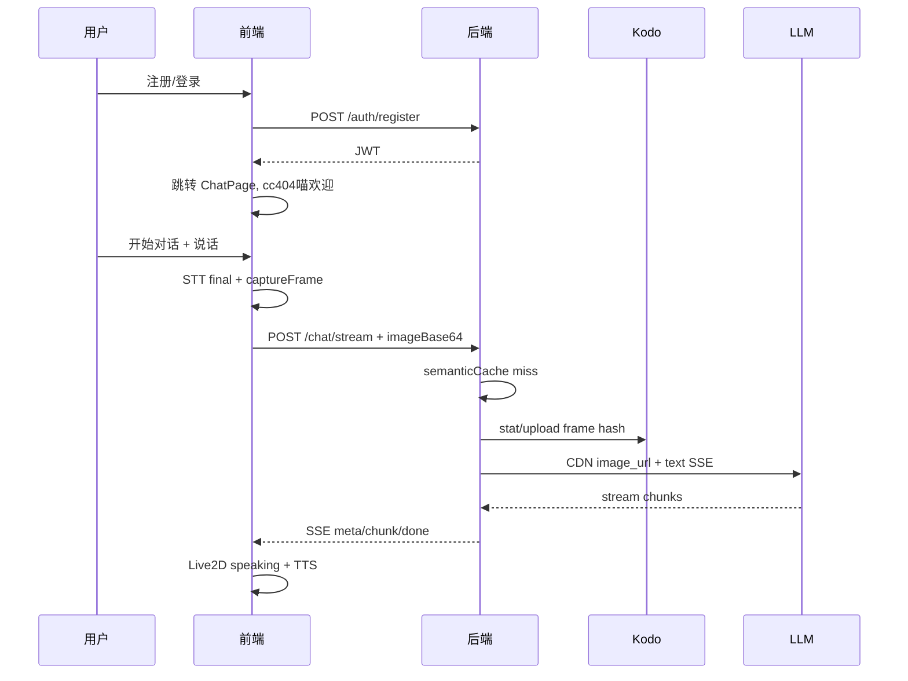

# 全栈工程方案 — 三天前后端实施设计

> **角色**：资深全栈工程师视角  
> **基础**：仓库已有 MVP（`client/` 媒体+STT+UI，`server/` chat 代理）  
> **目标**：V2 全量，虚拟助手 **cc404喵**（Claude Code 小章鱼发卡 · 活泼开朗）  
> **已确认架构决策**（沟通记录）：  
> - 帧上传：**混合** — Day 1 后端代传 Kodo，Day 2 前端直传  
> - 对话接口：**SSE 主路径**，`/api/chat` 仅调试兜底  
> - 多模态 LLM：**通义千问 qwen-vl-plus**（OpenAI 兼容模式）  
> - 协作模式：**两人全栈并行**，按模块认领，不按严格前后端切人  

---

## 1. 总体架构

```mermaid
flowchart TB
  subgraph frontend [前端 client :5173]
    Routes[ReactRouter]
    AuthUI[Login/Register]
    ChatPage[ChatPage]
    Media[Camera+Mic]
    STT[WebSpeechSTT]
    TTS[WebSpeechTTS]
    Frame[frameCapture]
    Live2D[cc404喵Live2D]
    StreamHook[useChatStream]
    KodoHook[useKodoUpload_D2]
  end

  subgraph backend [后端 server :3001]
    AuthR[/api/auth]
    QiniuR[/api/qiniu]
    ChatR[/api/chat_debug]
    StreamR[/api/chat/stream]
    STTR[/api/stt]
    JWT[JWT中间件]
    QiniuSvc[qiniuService]
    SemCache[semanticCache]
    LLM[llmService]
  end

  subgraph external [外部]
    Kodo[(七牛Kodo)]
    CDN[KCDN]
    VLM[通义千问qwen-vl]
    Whisper[WhisperSTT]
  end

  Routes --> AuthUI
  Routes --> ChatPage
  ChatPage --> Media
  ChatPage --> STT
  ChatPage --> Live2D
  ChatPage --> StreamHook
  ChatPage --> KodoHook

  AuthUI --> AuthR
  StreamHook --> StreamR
  KodoHook --> QiniuR
  STT --> STTR

  StreamR --> JWT
  ChatR --> JWT
  QiniuR --> JWT
  STTR --> JWT

  StreamR --> SemCache
  StreamR --> QiniuSvc
  StreamR --> LLM
  QiniuSvc --> Kodo
  Kodo --> CDN
  CDN --> LLM
  STTR --> Whisper
```

---

## 2. 技术栈

| 层 | 选型 | 说明 |
|----|------|------|
| 前端框架 | React 19 + Vite 6 + TS | 已有 |
| 路由 | react-router-dom v7 | Day 1 新增 |
| 状态 | AuthContext + 局部 useState | 不加 Redux |
| Live2D | pixi.js 6 + pixi-live2d-display | Day 1–2；降级 AvatarFallback |
| 后端 | Express 4 + TS + tsx | 已有 |
| 数据库 | better-sqlite3 | 用户表，单文件 |
| 鉴权 | bcryptjs + jsonwebtoken | 24h |
| 对象存储 | qiniu SDK | Kodo + 上传凭证 |
| 缓存 | 内存 Map | 语义缓存 TTL 10min |
| 流式 | SSE | `text/event-stream` |
| LLM | 通义千问 qwen-vl-plus | DashScope 兼容模式，支持 image_url |

---

## 3. 目录结构（目标态）

### 3.1 前端 `client/src/`

```
src/
├── main.tsx
├── App.tsx                 # BrowserRouter + Routes
├── context/
│   └── AuthContext.tsx     # token, username, login/logout
├── pages/
│   ├── Login.tsx
│   ├── Register.tsx
│   └── ChatPage.tsx        # 原 App 主逻辑迁移
├── components/
│   ├── Live2DAvatar.tsx    # cc404喵 + 章鱼发卡
│   ├── AvatarFallback.tsx  # 应急 PNG
│   ├── VideoPreview.tsx
│   ├── ChatPanel.tsx       # 支持 streamingMessage
│   └── StatusBar.tsx       # tokens/kodo/semantic
├── hooks/
│   ├── useMediaStream.ts   # + facingMode 切换
│   ├── useSpeechRecognition.ts  # + 云端 STT 降级
│   ├── useSpeechSynthesis.ts    # + 分段 speak
│   ├── useChatStream.ts    # SSE 主路径
│   └── useKodoUpload.ts    # Day 2 直传
└── lib/
    ├── api.ts              # authFetch 封装
    └── frameCapture.ts
```

### 3.2 后端 `server/src/`

```
src/
├── index.ts                # 挂载路由、限流、静态资源(D3)
├── db.ts                   # SQLite users
├── middleware/
│   └── auth.ts             # JWT 校验
├── routes/
│   ├── auth.ts             # register / login / me
│   ├── chat.ts             # POST /chat 调试兜底
│   ├── chatStream.ts       # POST /chat/stream SSE 主路径
│   ├── qiniu.ts            # upload-token
│   └── stt.ts              # 云端 STT
└── services/
    ├── llm.ts              # buildPrompt + call + stream
    ├── qiniu.ts            # hash/key/upload/stat/cdnUrl
    └── semanticCache.ts    # get/set
```

---

## 4. API 契约（前后端对齐）

### 4.1 鉴权

```http
POST /api/auth/register
Body: { "username": "alice", "password": "123456" }
→ 201 { "token": "...", "username": "alice" }

POST /api/auth/login
Body: { "username": "alice", "password": "123456" }
→ 200 { "token": "...", "username": "alice" }

GET /api/auth/me
Header: Authorization: Bearer {token}
→ 200 { "username": "alice", "userId": 1 }
```

**前端**：token 存 `localStorage.chat_token`；`api.ts` 统一 `authFetch`。

### 4.2 对话 — SSE 主路径

```http
POST /api/chat/stream
Header: Authorization: Bearer {token}
Content-Type: application/json

Body:
{
  "text": "我手里拿的是什么？",
  "imageBase64": "data:image/jpeg;base64,...",  // Day1 代传模式
  "imageKey": "frames/abc123.jpg",               // Day2 直传后传 key
  "skipImage": false,
  "history": [{ "role": "user"|"assistant", "content": "..." }]
}
```

**SSE 事件格式**：

```
event: meta
data: {"kodoHit":false,"semanticHit":false,"sentImage":true,"imageUrl":"https://..."}

event: chunk
data: {"text":"你"}

event: chunk
data: {"text":"手里"}

event: done
data: {"reply":"...","usage":{"total_tokens":120}}

event: error
data: {"error":"..."}
```

**前端 `useChatStream`**：读流 → 更新 streaming bubble → `done` 后写入 history → 触发分段 TTS。

### 4.3 对话 — 调试兜底

```http
POST /api/chat
```
同上 Body，JSON 一次性返回（Postman / 回归测试用，**ChatPage 不调用**）。

### 4.4 七牛（Day 2 启用直传）

```http
GET /api/qiniu/upload-token?key=frames/{hash}.jpg
→ { "token": "...", "key": "...", "cdnUrl": "https://..." }
```

前端：`PUT` 到 `https://upload.qiniup.com`（FormData: file, token, key）。

### 4.5 云端 STT

```http
POST /api/stt
Body: { "audioBase64": "...", "mimeType": "audio/webm" }
→ { "text": "识别结果" }
```

---

## 5. 核心业务流程

### 5.1 Day 1 — 注册到首次对话（后端代传）



### 5.2 Day 2 — 直传模式

1. 前端 `frameHash` → `GET upload-token`
2. 直传 Kodo → 只发 `imageKey`（不发 base64）
3. 后端 stat 命中 → `kodoHit: true`

### 5.3 语义缓存

```
cacheKey = `${frameHash ?? "no-frame"}:${normalize(text)}`
命中 → SSE 直接 event:done，semanticHit:true，不调 LLM
```

---

## 6. 三天方案 — 模块并行（两人全栈）

> 两人都会前后端，**按模块认领**，模块内自行切 FE/BE，每日 14:00 / 18:00 联调。

### 6.1 模块划分

| 模块 | 范围 | 建议负责人 | 依赖 |
|------|------|-----------|------|
| **M1 Auth** | 注册登录 JWT + Login/Register/守卫 | 开发者 1 | 无 |
| **M2 Qiniu** | 开通 Kodo/CDN + qiniu 服务 + 代传/直传 | 开发者 2 | 无 |
| **M3 Chat/SSE** | stream 路由 + llm 千问 + semanticCache | 开发者 2 | M1 JWT |
| **M4 cc404喵** | Live2D + Fallback + 四态 + 章鱼发卡 | 开发者 1 | M1 登录页 |
| **M5 媒体语音** | 摄像头切换 + STT/TTS + 连续对话 + STT降级 | 开发者 1 | M3 SSE |
| **M6 联调/UI** | ChatPage 整合 + StatusBar + 弱网 | 共同 | M1–M5 |

### 6.2 Day 1 — 跑通主链路

| 时段 | 开发者 1 | 开发者 2 | 联调点 |
|------|---------|---------|--------|
| 09–11 | M1：Auth 前端页面 + AuthContext | M2：七牛开通 + `qiniu.ts` + auth 后端 | — |
| 11–13 | M1：ProtectedRoute + ChatPage 骨架 | M1：SQLite + `/auth/*` + JWT 中间件 | **13:00** 注册登录通 |
| 14–16 | M4：Live2D 挂载 idle/listening | M3：`llm.ts` 千问 + `/chat/stream` 骨架 | **16:00** 带 token 调 stream |
| 16–18 | M4：欢迎语 + AvatarFallback | M2+M3：后端代传 Kodo + meta 字段 | **18:00** 登录→说话→SSE 出字 |

### 6.3 Day 2 — V2 能力

| 时段 | 开发者 1 | 开发者 2 | 联调点 |
|------|---------|---------|--------|
| 09–11 | M4：thinking/speaking + 章鱼发卡动效 | M2：`upload-token` + 语义缓存 | — |
| 11–13 | M5：useChatStream 接 SSE 流式 UI | M3：stream 稳定 + semanticHit | **13:00** 流式完整 |
| 14–16 | M5：连续 STT + 摄像头切换 | M2：直传联调；M3：`/api/stt` | **16:00** kodoHit 演示 |
| 16–18 | M5：分段 TTS | M3：done 事件 usage 字段 | **18:00** 四态+缓存 |

### 6.4 Day 3 — 交付

| 时段 | 开发者 1 | 开发者 2 |
|------|---------|---------|
| 09–11 | M5：STT 降级 + 弱网重试 UI | M6：限流 + build + 静态托管 |
| 11–13 | M6：StatusBar 三态 + UI 打磨 | 文档 DESIGN 13/13 |
| 14–18 | 演示视频 | GitHub push + 联合验收 |

---

## 6B. 原前后端能力清单（模块内参考）

### 前端职责摘要

| 天 | 关键产出 |
|----|---------|
| D1 | Router、Auth UI、ChatPage、Live2D idle |
| D2 | useChatStream、useKodoUpload、四态、摄像头 |
| D3 | STT 降级 UI、StatusBar、演示 |

### 后端职责摘要

| 天 | 关键产出 |
|----|---------|
| D1 | auth、qiniu 代传、stream 骨架、JWT |
| D2 | upload-token、semanticCache、stt、stream 完整 |
| D3 | 安全、build、文档 |

---

## 7. cc404喵 前端实现要点

| 模块 | 实现 |
|------|------|
| Live2D 模型 | 免费样本 + 后期替换；**章鱼发卡**独立 Part 或 Fallback PNG 叠加 |
| 状态映射 | listening→耳麦亮；thinking→触须快摆；speaking→口型 |
| Prompt | 后端 `buildSystemPrompt(username)` 注入活泼开朗人设 |
| 欢迎语 | ChatPage mount：`嗨，{username}！我是 cc404喵～` |

---

## 8. 环境变量

```env
# 通义千问（多模态视觉）
OPENAI_API_KEY=sk-xxx                    # 阿里云 DashScope API Key
OPENAI_BASE_URL=https://dashscope.aliyuncs.com/compatible-mode/v1
OPENAI_MODEL=qwen-vl-plus

# Auth
JWT_SECRET=

# 七牛
QINIU_ACCESS_KEY=
QINIU_SECRET_KEY=
QINIU_BUCKET=
QINIU_CDN_DOMAIN=

# Server
PORT=3001
CLIENT_ORIGIN=http://localhost:5173
MAX_REQUESTS_PER_MINUTE=10
```

> STT 降级仍可用同一 DashScope Key 调 `paraformer-v2` 或 Whisper 兼容端点（Day 2 实现）。

---

## 9. 风险与降级

| 风险 | 前端 | 后端 |
|------|------|------|
| 七牛未就绪 | 仍传 base64 | `isQiniuConfigured()` 跳过 Kodo |
| Live2D 失败 | AvatarFallback | — |
| SSE 中断 | 显示重试按钮 | 超时 30s |
| Web Speech 不可用 | 录音→/api/stt | Whisper 兼容 |

---

## 10. 沟通记录（迭代）

| 轮次 | 议题 | 结论 |
|------|------|------|
| 第 1 轮 | 帧上传架构 | **混合**：D1 后端代传，D2 直传 |
| 第 1 轮 | 对话 API | **SSE 主路径**，/chat 仅调试 |
| 第 2 轮 | 协作模式 | **两人全栈并行**，按模块 M1–M6 认领 |
| 第 3 轮 | 多模态 LLM | **通义千问 qwen-vl-plus**（DashScope 兼容 API） |
| 第 4 轮 | 待定 | 见下方 |

---

| 第 4 轮 | 模块认领 | **你：M1+M4+M5**｜搭档：**M2+M3** |
| 第 4 轮 | Live2D 素材 | **AI 生成立绘**（GPT 等）→ PNG 分层；Live2D 样本作骨骼占位；章鱼发卡独立图层 |
| 第 4 轮 | 部署 | **本地 demo**（`npm run dev`） |

---

## 12. cc404喵 素材工程说明（GPT 生成）

> 你提到用 GPT 生成 Live2D 样本——工程上分三层，避免 Day 1 被 Cubism 工作流卡住。

| 层级 | 做法 | 负责 | 时间 |
|------|------|------|------|
| **L1 应急** | GPT 生成 cc404喵 全身立绘 PNG + 章鱼发卡透明 PNG → `AvatarFallback` CSS 动效 | 你（M4） | Day 1 上午 |
| **L2 叠加** | 免费 Live2D 样本（Haru 等）跑通四态 → 发卡作为 Pixi _sprite 叠加在模型头顶 | 你（M4） | Day 1 下午 |
| **L3 完整** | 若有 Cubism：GPT 立绘拆层导入编辑器导出 `.model3.json`（**可选，不阻塞验收**） | 你或搭档 | Day 2+ |

**GPT 提示词要点**（写入 M4 任务卡）：

```
二次元猫耳少女，名为 cc404喵，活泼开朗；
头戴 Claude Code 风格橙色 Q 版小章鱼发卡；
科技耳麦，蓝白暖橙配色，透明背景，全身立绘，动漫风
```

**注意**：GPT 输出的是**位图**，不是可直接驱动的 Live2D 模型；验收以 **L1/L2 可见发卡 + 四态** 为准。

---

## 13. 最终模块认领

| 模块 | 负责人 | 前后端内容 |
|------|--------|-----------|
| M1 Auth | **你** | Login/Register/AuthContext + SQLite/auth 路由（可让搭档写后端 auth，你写前端） |
| M2 Qiniu | **搭档** | 七牛开通、qiniu.ts、代传/直传/token |
| M3 Chat/SSE | **搭档** | llm 千问、semanticCache、/chat/stream |
| M4 cc404喵 | **你** | GPT 素材、Live2D/Fallback、四态 |
| M5 媒体语音 | **你** | STT/TTS、摄像头、连续对话、STT 降级 UI |
| M6 联调 | **共同** | Day 1/2 14:00 & 18:00；Day 3 演示 |

---

## 14. 本地开发（无公网部署）

```bash
npm install
cp .env.example .env   # 填入 DashScope + 七牛 + JWT
npm run dev
# 前端 http://localhost:5173
# 后端 http://localhost:3001
```

评审演示：**本机屏幕录制**，无需 Day 3 部署。

---

## 15. Day 1 联调清单

详见 **[DAY1_INTEGRATION_CHECKLIST.md](./DAY1_INTEGRATION_CHECKLIST.md)**（Auth Mock、前端 Stub、后端 curl 验收、13:00/18:00 勾选表）。
