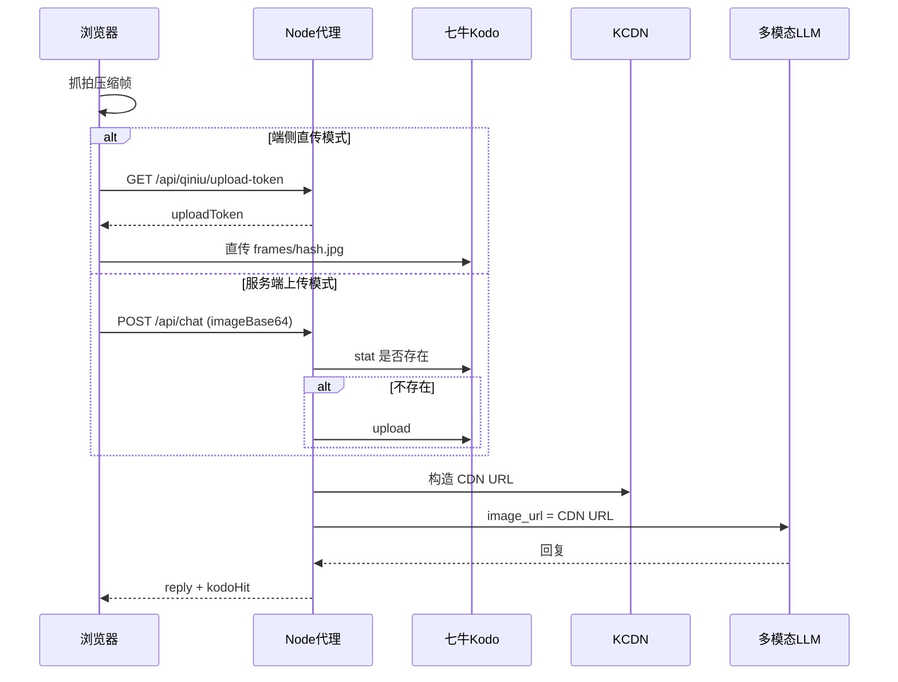

# 七牛云从 0 搭建指南

> 适用：当前没有任何七牛云资源，需从注册到代码接入的完整路径。  
> 负责人：**开发者 B**（Day 1 上午优先执行）

---

## 1. 目标

三天内完成：

| 阶段 | 能力 |
|------|------|
| Day 1 | 账号 + Bucket + CDN 测试域名 + 服务端 Kodo 上传 |
| Day 2 | 上传凭证 API + 端侧直传 |
| Day 3 | 演示缓存命中 + 文档定稿 |

---

## 2. 注册与实名（约 30 分钟）

1. 打开 [七牛云官网](https://www.qiniu.com/)
2. 点击「免费注册」，使用邮箱或手机号
3. 登录 [控制台](https://portal.qiniu.com/)
4. 完成**个人实名认证**（上传身份证，通常几分钟到几小时）

> **注意**：未实名无法创建部分资源。Day 1 09:00 第一件事是注册 + 提交实名。

---

## 3. 创建对象存储 Bucket（约 15 分钟）

1. 控制台 → **对象存储 Kodo** → **空间管理** → **新建空间**
2. 推荐配置：

| 配置项 | 建议值 |
|--------|--------|
| 空间名称 | `chat-assistant-frames`（全局唯一，可自定） |
| 存储区域 | 华东-浙江（离开发机器近即可） |
| 访问控制 | **公开空间**（演示简单；生产改私有+签名 URL） |

3. 记录 **Bucket 名称** → 填入 `.env` 的 `QINIU_BUCKET`

---

## 4. 获取 AccessKey / SecretKey（约 5 分钟）

1. 控制台 → 右上角头像 → **密钥管理**
2. 创建 AK/SK（或使用已有）
3. **切勿**提交到 Git 或前端代码

```env
QINIU_ACCESS_KEY=你的AccessKey
QINIU_SECRET_KEY=你的SecretKey
```

---

## 5. 配置 CDN 加速域名（约 20 分钟）

### 5.1 绑定域名

1. 控制台 → **CDN** → **域名管理** → **创建域名**
2. 源站类型：**对象存储**
3. 源站域名：选择刚建的 Bucket
4. 加速域名：
   - **有备案域名**：填你的域名（如 `cdn.yourdomain.com`）
   - **无备案**：先用七牛**测试域名**（控制台会提供，有效期有限）

### 5.2 验证

浏览器访问：

```
https://{你的CDN域名}/test.txt
```

可先在 Bucket 里手动上传一个 `test.txt` 验证。

```env
QINIU_CDN_DOMAIN=https://你的CDN域名
```

---

## 6. 完整 .env 配置示例

```env
# OpenAI 兼容 API
OPENAI_API_KEY=sk-xxx
OPENAI_BASE_URL=https://api.openai.com/v1
OPENAI_MODEL=gpt-4o-mini

# 服务
PORT=3001
CLIENT_ORIGIN=http://localhost:5173
JWT_SECRET=请换成随机长字符串

# 七牛云
QINIU_ACCESS_KEY=
QINIU_SECRET_KEY=
QINIU_BUCKET=chat-assistant-frames
QINIU_CDN_DOMAIN=https://xxx.clouddn.com

# 成本控制
MAX_REQUESTS_PER_MINUTE=10
```

---

## 7. 架构：帧如何在七牛流转



---

## 8. 代码接入说明

### 8.1 帧命名规则

```
frames/{sha256前32位}.jpg
```

- 同内容帧 → 同 key → Kodo stat 命中 → `kodoHit: true`

### 8.2 服务端接口

| 接口 | 说明 |
|------|------|
| `GET /api/qiniu/upload-token?key=frames/xxx.jpg` | 返回直传凭证（需登录） |
| `POST /api/chat` | 支持 `imageBase64` 或 `imageKey` |
| `POST /api/chat/stream` | 同上，SSE 流式 |

### 8.3 响应字段

```json
{
  "reply": "你手里拿的是一杯水。",
  "kodoHit": true,
  "semanticHit": false,
  "imageUrl": "https://cdn.xxx.com/frames/abc.jpg",
  "sentImage": true,
  "usage": { "total_tokens": 95 }
}
```

### 8.4 语义缓存（服务端内存）

- Key：`{frameHash}:{normalizedText}`
- TTL：10 分钟
- 命中时 `semanticHit: true`，不调 LLM

---

## 9. 未配置七牛时的降级

若 Day 1 17:00 七牛仍未就绪：

- 服务端 `isQiniuConfigured()` 返回 false
- 回退为 base64 直送 LLM（现有 MVP 行为）
- 状态栏 `kodoHit` 始终 false
- **文档与演示话术仍按七牛方案准备**，账号就绪后热切换 `.env` 即可

---

## 10. 成本对比（评审用）

| 方案 | 单次对话视觉成本 | 说明 |
|------|-----------------|------|
| 持续视频流上传 | 极高 | 不做 |
| 每轮 base64 直传 LLM | ~$0.0001/轮 | MVP 默认 |
| Kodo 缓存 + CDN URL | 重复场景 ~$0 | 同帧不重复理解 |
| + 语义缓存 | 同图同问 ~$0 | 不调 LLM |

---

## 11. Day 1 验收清单

- [ ] 七牛账号已注册
- [ ] 实名已提交（最好已通过）
- [ ] Bucket 已创建
- [ ] CDN 测试域名可访问 test 文件
- [ ] `.env` 七牛四项已填
- [ ] 服务端上传一帧成功，CDN URL 可在浏览器打开
- [ ] 第二次同帧请求返回 `kodoHit: true`

---

## 12. V2.1 扩展（三天外，可写进答辩 PPT）

- Bucket 生命周期：7 天自动删除旧帧
- 私有空间 + 签名 URL
- 边缘函数对帧做预处理（缩略、打码）
- 与七牛 AI 推理平台联动

---

## 13. 常见问题

**Q：测试域名过期怎么办？**  
A：重新申请测试域名，或绑定已备案正式域名。

**Q：LLM 无法访问 CDN 图片？**  
A：确保 Bucket/ CDN 为公开读，或改用带签名的临时 URL。

**Q：upload token 403？**  
A：检查 Bucket 名、key 路径、AK/SK 是否正确；服务器时间是否同步。

---

## 14. 参考链接

- [七牛对象存储文档](https://developer.qiniu.com/kodo)
- [七牛 CDN 文档](https://developer.qiniu.com/fusion)
- [上传凭证说明](https://developer.qiniu.com/kodo/1242/upload-token)
